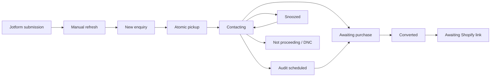

# Architecture

The CRM is intentionally separate from the internal operations dashboard. It owns customer, opportunity, interaction, activity, audit-appointment, purchase-link-send, and sales-history records. Shopify remains the payment/checkout source of truth; the CRM creates a pending handoff only.

The browser never stores upstream Eyeagle tokens. The API exchanges credentials with the Eyeagle identity service, encrypts returned tokens in `crm_sessions`, and issues an opaque HTTP-only CRM cookie. API authorization is derived from the CRM membership on every request.

Business mutations use database transactions. Opportunity claim is a conditional update after a capacity check in the same transaction. Activities, reminders, next-action state, ownership history, immutable audit events, calendar intents, purchase-link sends, and order handoffs are committed with their state transition. The worker uses row locking with `SKIP LOCKED` so multiple instances do not process the same due item.

Jotform intake is manually pulled by an authenticated member using a server-held read-only key. Form/submission IDs provide idempotency. An exact customer with an open opportunity receives a repeat-enquiry event and owner notification. Shared-phone ambiguity and do-not-contact matches are held for admin review.

The Eyeagle interest form is treated as a qualification source, not a free-text contact form. The CRM preserves who the enquiry is for, selected safety concerns, immediate-concern flag, requested next step, and preferred contact window as structured opportunity fields. The original combined summary remains available for context, while queues and filters operate on the structured answers.

Audit appointments use a transactional job outbox. The worker creates or patches one Google event with a stable custom event ID; retries reuse the same ID. A post-audit sales activity is created for the next working day, where working days are Monday through Saturday. The customer is never added as an attendee in V1.

## Trust boundaries

- Internet browser → Vercel web app
- Vercel/server app → CRM API over TLS with CORS limited to configured origins
- CRM API → allowlisted Jotform form with a read-only key
- API/worker → PostgreSQL over TLS
- API → Eyeagle identity service
- Worker → Google Calendar and Eyeagle email provider

## Initial consistency rules

- PostgreSQL is the system of record; UI caches are disposable.
- All timestamps are `timestamptz` in UTC and displayed in `Asia/Kolkata`.
- Audit events cannot be updated or deleted.
- Every active or snoozed opportunity has a next activity, review date, audit, purchase review, or explicit closure.
- Audit events and interaction history are immutable; corrective actions append history.
- Customer phone is indexed but not globally unique because shared family numbers are valid.
- Do-not-contact is customer-level and blocks outreach across opportunities.
