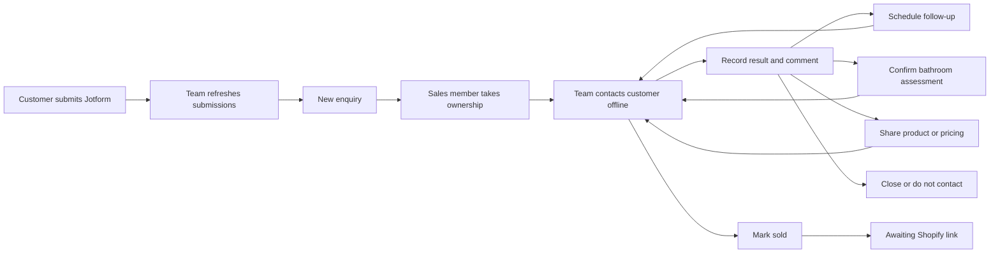

# Eyeagle Sales CRM — How the System Works

## Purpose

The Eyeagle CRM is a simple sales workspace for turning Jotform submissions into clear, owned follow-up work. It does not place calls, send WhatsApp messages, collect payments, or perform home assessments. Those activities happen outside the CRM; the team records what happened and what must happen next.

The system is designed around one rule:

> An open customer enquiry should always remain visible and have a clear owner, current status, and next action.

## The core records

The CRM separates information that serves different purposes:

- **Customer** — the long-lived person or family record, including contact details and do-not-contact status.
- **Opportunity** — one enquiry or possible purchase. A customer can have more than one opportunity over time.
- **Form submission** — the original, read-only answers imported from Jotform.
- **Action/history entry** — a record of what the sales member says happened outside the CRM.
- **Next action** — the exact future commitment owned by the sales team.
- **Confirmed assessment** — a bathroom assessment appointment whose date and time were explicitly agreed with the customer.
- **Order handoff** — a converted opportunity waiting for operations to connect it to the correct Shopify order.

## End-to-end workflow

## 1. Jotform intake

Jotform remains the source of new enquiries.

1. A team member selects **Refresh Jotform**.
2. The server fetches submissions from the allowlisted form using the server-held API key.
3. A valid new submission creates an unclaimed opportunity.
4. Refreshing again does not create the same submission twice.
5. Invalid or ambiguous submissions are held for admin review without blocking valid submissions.

The imported answers are preserved as **Full submission** and remain read-only. This gives sales the original context without allowing later conversations to rewrite what the customer submitted.

### Form context is not a commitment

- "Interested in a bathroom assessment" means the customer expressed interest; it does not mean an assessment is scheduled.
- A preferred callback day or period is guidance from the form; it is not automatically a team task or promised appointment.
- "Immediate concern" raises the enquiry's priority but does not create an emergency workflow. Eyeagle is not an emergency-response service.

## 2. New enquiries and ownership

The **New enquiries** view contains unclaimed submissions. It shows the customer, form context, preferred callback, submission age, and priority.

A sales member selects **Take ownership** before working the enquiry. Ownership establishes responsibility but does not claim that a call has already happened. Only one member can successfully claim an opportunity.

After ownership, the opportunity appears in **My work**.

## 3. My work and upcoming commitments

**My work** is the salesperson's commitment queue. It defaults to **All open**, so an opportunity does not disappear simply because its next action was moved to a future date.

Available views are:

- **All open** — every open opportunity owned by the current salesperson.
- **Due** — actions due now or overdue.
- **Upcoming** — actions scheduled for a future date.
- **No next action** — open records that need a new commitment.
- **Snoozed** — customers intentionally deferred until a review date.
- **Closed** — completed, lost, or do-not-contact opportunities.

Each row shows the customer, exact next step, contact status, current stage, last update, and the action button.

## 4. Taking action

Calls, messages, and conversations happen outside the CRM. The **Take action** dialog records the result afterward.

The salesperson records:

1. What happened, using the available selection.
2. A comment when additional context is needed.
3. The next step and its date when future work is required.

Possible decisions include:

- **Follow up later** — create an exact future follow-up.
- **Schedule bathroom assessment** — record a customer-confirmed appointment.
- **Share product or pricing** — record the discussion and schedule its review.
- **Customer wants to buy** — convert the opportunity and create an order handoff.
- **Not interested · close** — close with a reason.
- **Do not contact** — close and block future outreach.
- **Update number** — store the corrected number and schedule another attempt.

Selections keep routine data entry quick. Comments add useful context; they are not intended to repeat information already captured by the selection.

## 5. Follow-ups and changing dates

A follow-up is a future sales commitment, not a pipeline stage.

When a follow-up is scheduled:

- The opportunity stays in **All open**.
- It appears under **Upcoming** until it becomes due.
- At the scheduled time it moves into **Due**.
- A reminder appears in notifications.

If the customer calls back or asks to change the date, the salesperson opens the customer and selects **Change date**. The new date and a comment are required. The system keeps the opportunity visible and appends a history entry containing:

- the previous date;
- the new date; and
- the reason for the change.

The previous entry is never silently replaced or lost.

## 6. Bathroom assessments

Assessment interest and a confirmed appointment are deliberately separate.

An assessment becomes **Audit scheduled** only after sales records:

- the agreed date and time;
- duration;
- address;
- operations context; and
- confirmation that the customer agreed to that date and time.

After confirmation, the CRM creates the appointment, queues Google Calendar synchronization, and creates a next-working-day sales follow-up. The interface shows customer confirmation separately from Calendar status: pending, synced, or failed.

Changing a confirmed assessment uses the assessment-rescheduling flow because customer reconfirmation and Calendar synchronization are required. It does not use the simpler follow-up date control.

## 7. Product interest, sale, and order handoff

When a customer is interested in buying, sales can record that product or pricing was shared and set a review date. The opportunity remains visible under **Awaiting purchase** until the next decision.

When sales selects **Customer wants to buy**:

1. The opportunity becomes **Converted**.
2. The sales history becomes part of the permanent customer record.
3. The CRM creates a pending order handoff labelled **Awaiting Shopify link**.
4. Operations links or confirms the correct Shopify order.

Shopify remains the source of truth for checkout and payment. Marking an opportunity sold does not itself confirm payment.

## 8. History

Opening a customer displays **Call & action history**. This is a chronological, append-only record of comments and material changes, including:

- ownership;
- contact results;
- follow-ups;
- changed follow-up dates;
- confirmed assessments;
- product or pricing discussions;
- closure;
- reopening or reassignment; and
- conversion and order handoff.

Corrections add a new entry rather than deleting the old one. The original Jotform submission remains available separately as read-only context.

## 9. Notifications

Notifications are generated from owned work that needs attention, including:

- due and overdue follow-ups;
- upcoming follow-ups;
- confirmed assessment reminders;
- purchase reviews; and
- open opportunities with no next action.

Selecting a notification opens the relevant opportunity and the matching work view. Marking a notification as read does not complete or remove the underlying action.

## 10. Team and admin responsibilities

- **Sales member** — takes ownership, records offline contact results, sets next actions, confirms assessments, records product interest, and closes or converts owned work.
- **Team lead/admin** — sees the team queue, reassigns work, resolves import issues, reopens closed opportunities, manages approved purchase links, and corrects accidental handoffs.
- **Operations** — receives confirmed assessment appointments and pending order handoffs but does not rewrite sales history.

Reassignment moves responsibility for future work while preserving ownership history.

## 11. Important system rules

- Jotform answers are source context, not automatic sales commitments.
- Every open opportunity should remain visible in **All open**.
- Future work belongs in **Upcoming**; it should not disappear from the salesperson's desk.
- Changing a date preserves the previous date and reason in history.
- Confirmed assessment dates require explicit customer confirmation.
- Do-not-contact applies at customer level and blocks outreach across opportunities.
- Opportunities are never automatically closed after unanswered calls.
- Marking sold creates a pending handoff, not proof of Shopify payment.
- Integration credentials remain on the server and are never exposed in the browser.

## 12. Current V1 boundaries

The first version intentionally avoids automated calling, WhatsApp sending, email campaigns, forecasting, AI lead scoring, and a complex configurable pipeline. Its job is to give the team a reliable shared view of:

- who needs attention;
- who owns the enquiry;
- what happened in the latest conversation;
- what must happen next and when; and
- how the opportunity was eventually closed or handed to operations.
